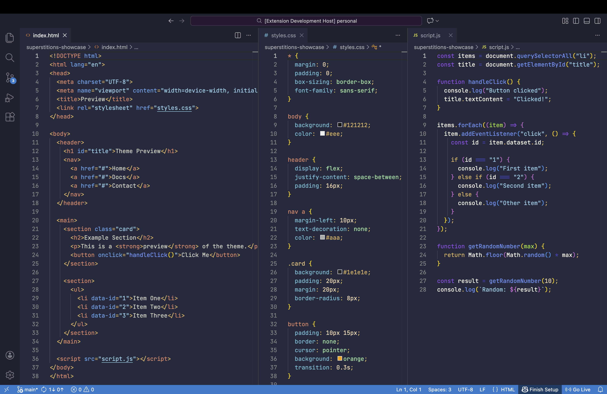
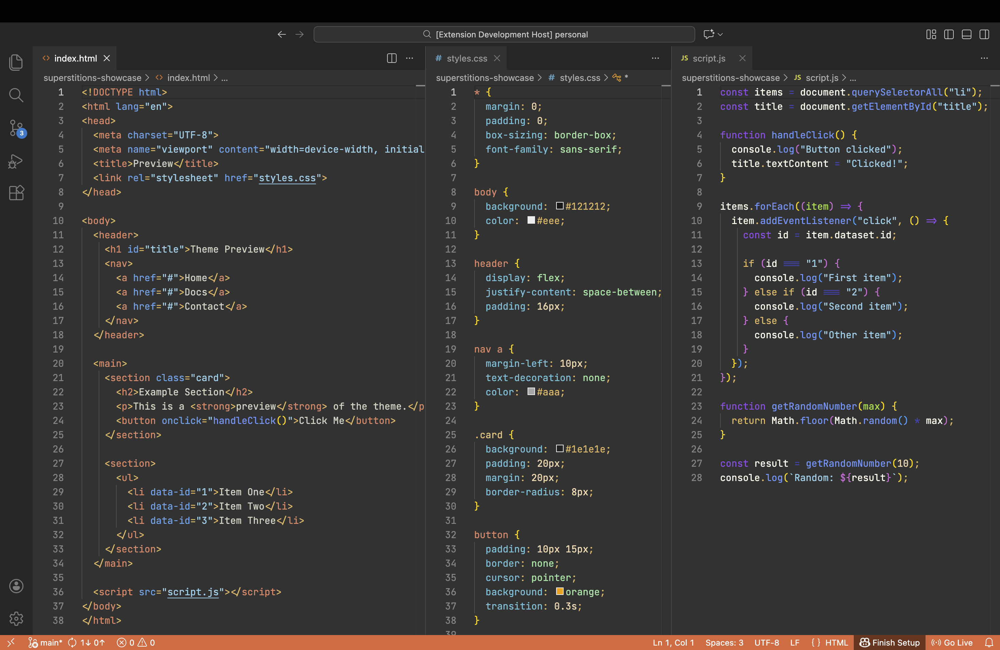

# Superstitions Theme:

## Install

Install directly from the VS Code Marketplace:
https://marketplace.visualstudio.com/items?itemName=aidenhillar.superstitions

Or inside VS Code:
- Open Extensions
- Search **Superstitions**
- Click Install

###### (if you prefer to download locally or are offline, scroll to the bottom for installation instructions)
---

# ***Thanks for downloading Superstitions!***
#### If you enjoy Superstitions, please feel free to recommend it to other devs you know

---

# Who is this theme for?

Any developer, really. I made it specifically for users with anti blue-light glasses and full-stack devs, but it looks great without the glasses.

If the default theme feels boring, hard to read, or straining, then this theme is worth giving a shot!

---

## Why I made this theme

It started as a solution for eyestrain. I had always wanted to make my own theme, but now that I had been using anti blue-light glasses for a while, the default Dark+ theme looked washed out and was uneasy on my eyes.

No other theme really clicked for me, so I decided to make my own. I watched this video by the official Visual Studio Code YouTube channel:
[Building your own VS Code theme](https://www.youtube.com/watch?v=FeApSxfazVg).

It walked me step by step on how to make my own theme, so I did.

---

## What does it look like / style?

The best way I would describe this theme, is:
- Candy colors & Matte
- Poppy/Vibrant but controlled
- Made to identify tokens quickly
- Easy on the Eyes

When paired with the recommended font (more on that in the next section) and anti blue-light glasses or filter, this theme makes it easier to read code comfortably for longer periods.

---

# What font should you use with this theme?

This theme was made to be used with JetBrains Mono Light.

#### Setup (file found at my [GitHub Repository](https://github.com/aiden-hill-ar/Superstitions-theme) or [Google Fonts](https://fonts.google.com/specimen/JetBrains+Mono?preview.layout=grid)):

1. Download the zip file and un-zip it
2. Install the variable font (***not*** the italic one) by right clicking and intalling, or opening the file and installing
3. Go to VS Code's search bar at the top and type **>Preferences: Open Settings (UI)**
4. Then type in the search bar of the settings, **Editor: Font Family**
5. You should see other fonts written there, good. That's normal. Now type in **'JetBrains Mono Light',** with the quotes as the first option
6. Restart VS Code

Finished!

#### Why choose this font?
1. It looks good but is simple
2. It's easy on the eyes
3. It's got better line spacing than other monospaced fonts
4. The light weight is better than the normal weight for code

---

If you prefer using another font to code, I just want to say that this theme was made with JetBrains Mono Light in mind, so results may vary from those that I am stating in this README.

---

#### Is this theme finished/where can I report a problem found in the theme? (like conflicting issues with certain code colors)

No, this theme is not finished as of late. I have made the majority of the theme, but I have only used it across HTML, CSS, and JS as those are the only languages I currently know.

If you find a conflict between two different sets of code then you can create a new issue in the issues tab on my GitHub [here](https://github.com/aiden-hill-ar/Superstitions-theme/issues), and fill it out to the best of your ability.

**Please keep the template text when submitting issues—it helps me quickly understand the problem.**
---

# Manual Install through GitHub (useful for offline or manual installs)

Download the latest [`.vsix`](https://github.com/aiden-hill-ar/Superstitions-theme/releases) file from the Releases section and install it in VS Code:

1. Open VS Code
2. Go to Extensions
3. Click the three dots (top right)
4. Select "Install from VSIX..."
5. Choose the downloaded file

###### Please keep in mind that downloading this theme from GitHub will not offer automatic updates and may not always be up to date.

---

## And remember to:
---

- # Code
- # Debug
- # Enjoy!

---
